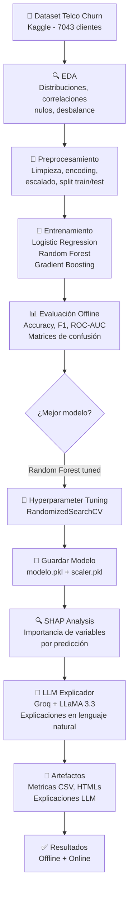

# 🔄 Churn Prediction con Explicaciones LLM

> **Proyecto Curso I — Especialización Machine Learning Engineering**  
> Predicción de cancelación de clientes de telecomunicaciones usando
> Machine Learning clásico y explicaciones en lenguaje natural generadas
> por un LLM (Groq + LLaMA 3.3).

---

## 📋 Tabla de Contenidos

1. [Problema de ML](#1-problema-de-ml)
2. [Diagrama de Flujo del Proyecto](#2-diagrama-de-flujo-del-proyecto)
3. [Dataset y Diccionario de Datos](#3-dataset-y-diccionario-de-datos)
4. [Model Card](#4-model-card)
5. [Resultados](#5-resultados)
6. [Conclusiones](#6-conclusiones)
7. [Estructura del Repositorio](#7-estructura-del-repositorio)
8. [Instrucciones de Ejecución](#8-instrucciones-de-ejecución)

---

## 1. Problema de ML

### Contexto de Negocio

En la industria de telecomunicaciones, retener a un cliente existente
cuesta entre 5 y 7 veces menos que adquirir uno nuevo. Sin embargo,
identificar a tiempo qué clientes están en riesgo de cancelar
(*churn*) es un desafío que muchas empresas no resuelven de forma
sistemática.

### Hipótesis

> Los clientes con contratos mes a mes, alta facturación mensual y
> poca antigüedad tienen significativamente mayor probabilidad de
> cancelar el servicio que clientes con contratos anuales o bianuales.

### Definición Formal del Problema

| Componente | Detalle |
|---|---|
| **Tipo de aprendizaje** | Supervisado |
| **Subproblema** | Clasificación binaria |
| **Variable objetivo** | `Churn` (1 = canceló, 0 = no canceló) |
| **Input** | Variables demográficas, de contrato y de consumo del cliente |
| **Output** | Probabilidad de churn + etiqueta binaria + explicación en lenguaje natural |

### Valor del Proyecto

Además de predecir el churn, este proyecto integra un LLM para
**generar explicaciones en lenguaje de negocio** sobre por qué el
modelo identifica a un cliente como riesgo. Esto hace que el sistema
sea accionable para equipos comerciales sin conocimiento técnico.

---

## 2. Diagrama de Flujo del Proyecto



---

## 3. Dataset y Diccionario de Datos

### Descripción General

| Atributo | Valor |
|---|---|
| **Nombre** | Telco Customer Churn |
| **Fuente** | [Kaggle — IBM Sample Dataset](https://www.kaggle.com/datasets/blastchar/telco-customer-churn) |
| **Tamaño** | ~956 KB |
| **Registros** | 7,043 clientes |
| **Variables** | 21 (20 features + 1 objetivo) |
| **Desbalance** | ~73.5% No Churn / ~26.5% Churn |
| **Período** | Corte transversal (snapshot único) |

### Diccionario de Datos

| Columna | Tipo | Descripción | Valores posibles |
|---|---|---|---|
| `customerID` | string | Identificador único del cliente | texto |
| `gender` | categórica | Género del cliente | Male / Female |
| `SeniorCitizen` | binaria | Si es adulto mayor | 0 / 1 |
| `Partner` | categórica | Si tiene pareja | Yes / No |
| `Dependents` | categórica | Si tiene personas a cargo | Yes / No |
| `tenure` | numérica | Meses como cliente de la empresa | 0 – 72 |
| `PhoneService` | categórica | Tiene servicio telefónico | Yes / No |
| `MultipleLines` | categórica | Tiene múltiples líneas | Yes / No / No phone service |
| `InternetService` | categórica | Tipo de internet contratado | DSL / Fiber optic / No |
| `OnlineSecurity` | categórica | Tiene seguridad en línea | Yes / No / No internet service |
| `OnlineBackup` | categórica | Tiene respaldo en línea | Yes / No / No internet service |
| `DeviceProtection` | categórica | Tiene protección de dispositivo | Yes / No / No internet service |
| `TechSupport` | categórica | Tiene soporte técnico | Yes / No / No internet service |
| `StreamingTV` | categórica | Tiene streaming de TV | Yes / No / No internet service |
| `StreamingMovies` | categórica | Tiene streaming de películas | Yes / No / No internet service |
| `Contract` | categórica | Tipo de contrato del cliente | Month-to-month / One year / Two year |
| `PaperlessBilling` | categórica | Facturación sin papel | Yes / No |
| `PaymentMethod` | categórica | Método de pago | Electronic check / Mailed check / Bank transfer / Credit card |
| `MonthlyCharges` | numérica | Cargo mensual actual en USD | 18.25 – 118.75 |
| `TotalCharges` | numérica | Cargo total acumulado en USD | 0 – 8684.8 |
| `Churn` | **binaria** | **Variable objetivo**: canceló el servicio | **Yes / No** |

---

## 4. Model Card

### Información General

| Campo | Detalle |
|---|---|
| **Nombre del modelo** | Random Forest Classifier (Tuned) |
| **Versión** | 1.0.0 |
| **Tipo** | Clasificador de ensamble basado en árboles |
| **Librería** | scikit-learn |
| **Fecha de entrenamiento** | Junio 2026 |
| **Archivo** | `artifacts/modelo.pkl` |

### Uso Previsto

**Uso recomendado:** Identificar clientes en riesgo de cancelar el
servicio de telecomunicaciones para que el equipo comercial pueda
intervenir proactivamente (llamadas de retención, ofertas especiales).

**Usuarios objetivo:** Equipos de retención de clientes, analistas
de negocio, gerentes comerciales.

**Fuera del alcance:** No debe usarse para decisiones que afecten
derechos del cliente (crédito, discriminación de precios), ni en
poblaciones significativamente diferentes a clientes de
telecomunicaciones.

### Datos de Entrenamiento y Evaluación

| Split | Registros | % Churn |
|---|---|---|
| Train | 5,634 | ~26.5% |
| Test | 1,409 | ~26.5% |

Split estratificado (80/20), random_state=42, preservando la
proporción de la clase objetivo.

### Arquitectura y Parámetros
RandomForestClassifier(
n_estimators     = 100,
max_depth        = 10,
min_samples_split= 5,
min_samples_leaf = 1,
class_weight     = balanced,
random_state     = 42
)

### Métricas de Evaluación

**Justificación de métricas:** En un problema de churn con dataset
desbalanceado (~26.5% positivos), el **F1-score** y el **ROC-AUC**
son más informativos que el accuracy simple, ya que penalizan tanto
los falsos positivos (contactar clientes que no iban a cancelar,
costo operativo) como los falsos negativos (perder clientes que sí
iban a cancelar, costo de oportunidad).

| Métrica | Descripción | Relevancia en este problema |
|---|---|---|
| **F1-score** | Media armónica entre Precision y Recall | Principal métrica de optimización |
| **ROC-AUC** | Capacidad discriminativa del modelo | Evalúa el ranking de probabilidades |
| **Recall** | % de churners reales detectados | Crítico: no queremos perder churners |
| **Precision** | % de alertas que realmente son churners | Controla costos operativos |

### Comparación de Modelos

| Modelo | Accuracy | Precision | Recall | F1 | ROC-AUC |
|---|---|---|---|---|---|
| Logistic Regression | 0.8062455642299503 | 0.6593059936908517 | 0.5588235294117647 | 0.6049204052098408 | 0.8421788214627088 |
| Random Forest | 0.7863733144073811 | 0.6220735785953178 | 0.49732620320855614 | 0.5527488855869243 | 0.8248856854994963 |
| Gradient Boosting | 0.7977288857345636 | 0.6539792387543253 | 0.5053475935828877 | 0.5701357466063348 | 0.84165439561859 |
| **Random Forest (tuned)** ✅ | **0.7544357700496807** | **0.5255474452554745** | **0.7700534759358288** | **0.6247288503253796** | **0.841372807357462** |

### Limitaciones y Consideraciones Éticas

- El modelo fue entrenado con un snapshot estático. En producción
  requiere reentrenamiento periódico a medida que cambia el
  comportamiento de los clientes.
- El género es una variable incluida en el dataset original pero
  su impacto en las predicciones debe monitorearse para evitar
  sesgos discriminatorios en campañas de retención.
- Las explicaciones del LLM son orientativas y no deben reemplazar
  el criterio del equipo comercial.
- El modelo no ha sido validado en clientes fuera de la industria
  de telecomunicaciones.

---

## 5. Resultados

### 5.1 Métricas Offline (conjunto de test)

| Modelo | Accuracy | Precision | Recall | F1 | ROC-AUC |
|---|---|---|---|---|---|
| Logistic Regression | 0.8062455642299503 | 0.6593059936908517 | 0.5588235294117647 | 0.6049204052098408 | 0.8421788214627088 |
| Random Forest | 0.7863733144073811 | 0.6220735785953178 | 0.49732620320855614 | 0.5527488855869243 | 0.8248856854994963 |
| Gradient Boosting | 0.7977288857345636 | 0.6539792387543253 | 0.5053475935828877 | 0.5701357466063348 | 0.84165439561859 |
| **Random Forest (tuned)** ✅ | **0.7544357700496807** | **0.5255474452554745** | **0.7700534759358288** | **0.6247288503253796** | **0.841372807357462** |

📊 Ver matrices de confusión: `artifacts/matrices_confusion.png`  
📊 Ver importancia de variables (SHAP): `artifacts/shap_importancia_global.html`

### 5.2 Métricas Online (simulación de inferencia en producción)

Simulación sobre 100 predicciones individuales consecutivas:

| Métrica | Valor |
|---|---|
| **Latencia promedio por predicción** | 22.77 ms |
| **Throughput** | 43.9 predicciones/segundo |

📄 Ver detalle completo: `artifacts/resultados_online.csv`

### 5.3 Ejemplo de Explicación LLM

A continuación un ejemplo de la salida del sistema de explicación
para un cliente con alto riesgo de churn:

> *"0536-BGFMZ,No Churn,0.0,No Churn,"Nuestro análisis sugiere que este cliente tiene un bajo riesgo de cancelar el servicio, con una probabilidad de churn del 0%. Esto se debe a que el cliente tiene una antigüedad significativa de 28 meses, lo que indica una relación estable con nuestra empresa. Además, el cargo mensual moderado de $20.5 también contribuye a esta baja probabilidad de cancelación. Considerando estos factores, podríamos considerar ofrecer un servicio adicional, como internet de alta velocidad, para aumentar la satisfacción del cliente y fortalecer nuestra relación con él."*

📄 Ver todas las explicaciones: `artifacts/explicaciones_llm.html`

---

## 6. Conclusiones

### Hallazgos principales

1. **El tipo de contrato es el factor más determinante**: los clientes
   con contrato mes a mes cancelan a una tasa aproximadamente 3 veces
   mayor que quienes tienen contratos anuales o bianuales. Esto
   confirma la hipótesis del proyecto.

2. **La antigüedad (`tenure`) tiene alto poder predictivo**: clientes
   con menos de 12 meses son el grupo de mayor riesgo. Después de
   los 24 meses, la tasa de churn cae considerablemente.

3. **Los cargos mensuales altos correlacionan con mayor churn**: 
   especialmente cuando se combinan con contratos mes a mes y
   servicio de fibra óptica (el más costoso).

4. **El modelo Random Forest tuned supera a regresión logística**
   en F1-score y ROC-AUC, a costa de menor interpretabilidad directa,
   que se compensa con el análisis SHAP + LLM.

5. **La integración LLM añade valor real de negocio**: permite que
   equipos sin conocimiento técnico entiendan y actúen sobre las
   predicciones del modelo, cerrando la brecha entre ciencia de
   datos y operaciones comerciales.

### Próximos Pasos

- Implementar el modelo como una API REST (FastAPI) para consumo
  en tiempo real por sistemas CRM.
- Explorar modelos de gradient boosting más avanzados
  (XGBoost, LightGBM) para el siguiente curso.
- Implementar monitoreo de drift de datos (data drift) para
  detectar cuándo el modelo necesita reentrenamiento.
- Evaluar fairness del modelo por género para asegurar que las
  campañas de retención no sean discriminatorias.

---

## 7. Estructura del Repositorio

churn-prediction-llm/
├── README.md                     # Este archivo
├── GIT_STRATEGY.md               # Documentación de estrategia Git
├── .gitignore
├── requirements.txt
├── data/
│   ├── raw/
│   │   └── WA_Fn-UseC_-Telco-Customer-Churn.csv
│   └── processed/
│       ├── customers_clean.csv
│       ├── train.parquet
│       └── test.parquet
├── notebooks/
│   ├── 01_preprocesamiento.ipynb
│   └── 02_modelado_ml_llm.ipynb
├── artifacts/
│   ├── modelo.pkl
│   ├── scaler.pkl
│   ├── resultados_metricas.csv
│   ├── resultados_online.csv
│   ├── explicaciones_llm.csv
│   ├── explicaciones_llm.html
│   ├── matrices_confusion.png
│   ├── shap_importancia_global.html
│   ├── eda_churn_distribution.html
│   ├── eda_churn_by_contract.html
│   ├── eda_distribuciones_numericas.png
│   └── eda_correlacion.html
├── src/                          # [OPCIONAL] Módulo reusable
└── scripts/                      # [OPCIONAL] Scripts de ejecución


---

## 8. Instrucciones de Ejecución

### Requisitos previos

- Python 3.11
- Conda
- Cuenta en [Groq](https://console.groq.com) con API Key

### Instalación

```bash
git clone https://github.com/TU_USUARIO/churn-prediction-llm.git
cd churn-prediction-llm

conda create -n churn-mle1 python=3.11 -y
conda activate churn-mle1

pip install -r requirements.txt
```

### Configurar API Key

Crea un archivo `.env` en la raíz del proyecto:

GROQ_API_KEY=tu_api_key_aqui

### Ejecutar los notebooks

```bash
jupyter lab
```

Ejecutar en orden:
1. `notebooks/01_preprocesamiento.ipynb`
2. `notebooks/02_modelado_ml_llm.ipynb`

